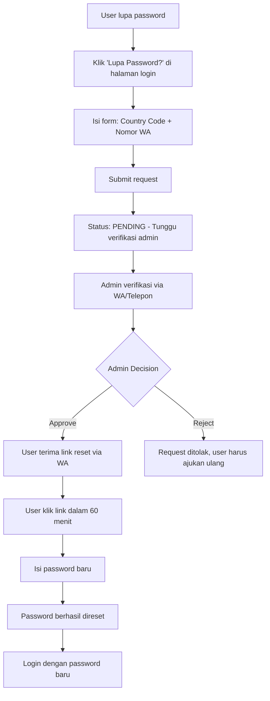
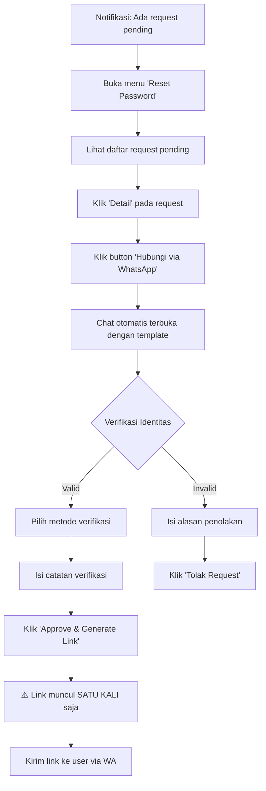

# Manual Password Reset - Dokumentasi Lengkap

## 📋 Daftar Isi
1. [Overview](#overview)
2. [Alur Kerja Sistem](#alur-kerja-sistem)
3. [Instalasi & Setup](#instalasi--setup)
4. [Panduan Penggunaan](#panduan-penggunaan)
5. [Fitur Keamanan](#fitur-keamanan)
6. [Konfigurasi](#konfigurasi)
7. [Technical Details](#technical-details)
8. [Troubleshooting](#troubleshooting)

---

## 📖 Overview

Sistem **Manual Password Reset** adalah fitur yang memungkinkan user dan admin untuk mereset password mereka melalui proses verifikasi manual oleh administrator. Fitur ini menggantikan sistem reset otomatis untuk meningkatkan keamanan akun.

### ✨ Fitur Utama
- ✅ Request reset password via nomor WhatsApp
- ✅ Verifikasi manual oleh admin (telepon/WhatsApp)
- ✅ Generate one-time secure token (berlaku 60 menit)
- ✅ Multi-country support (15 negara)
- ✅ Rate limiting (3 percobaan per 15 menit)
- ✅ Full audit trail & IP logging
- ✅ RBAC (Role-Based Access Control)
- ✅ WhatsApp integration untuk komunikasi
- ✅ Dashboard admin dengan statistik real-time

---

## 🔄 Alur Kerja Sistem

### Alur User (Pemohon)


### Alur Admin (Verifikator)


---

## 🛠️ Instalasi & Setup

### 1. Migrasi Database
```bash
# Jalankan migration untuk membuat tabel password_reset_requests
php artisan migrate
```

**Tabel yang dibuat:**
- `password_reset_requests` (23 kolom)
  - Request info: user_type, phone_number, country_code, status
  - Token info: token_hash, token_created_at, token_expires_at
  - Approval info: approved_by_admin_id, verification_method, verification_notes
  - Usage tracking: used, used_at, used_ip
  - Rejection info: rejected_by_admin_id, rejection_reason
  - Audit: request_ip, request_user_agent, admin_ip

### 2. Routes (Sudah Terdaftar)
**Public Routes (Guest):**
```php
GET  /password/forgot          → Form request reset
POST /password/request         → Submit request (rate limited)
GET  /password/reset/{token}   → Form reset password
POST /password/reset           → Update password
```

**Admin Routes (Auth Required):**
```php
GET    /admin/password-reset              → Daftar request
GET    /admin/password-reset/{id}         → Detail request
POST   /admin/password-reset/{id}/approve → Approve & generate token
POST   /admin/password-reset/{id}/reject  → Reject request
DELETE /admin/password-reset/{id}         → Hapus (super_admin only)
```

### 3. Model & Controller
**Models:**
- `App\Models\PasswordResetRequest`

**Controllers:**
- `App\Http\Controllers\Auth\PasswordResetController`
- `App\Http\Controllers\Admin\PasswordResetManagementController`

### 4. Views
**User Views:**
- `resources/views/auth/forgot-password.blade.php`
- `resources/views/auth/reset-password.blade.php`

**Admin Views:**
- `resources/views/admin/password-reset/index.blade.php`
- `resources/views/admin/password-reset/show.blade.php`

---

## 📱 Panduan Penggunaan

### Untuk User

#### 1. Request Reset Password
1. Buka halaman login (`/login` atau `/admin/login`)
2. Klik link **"Lupa Password?"**
3. Pilih **Country Code** (default: +62 Indonesia)
4. Masukkan **Nomor WhatsApp** (tanpa kode negara)
5. Klik **"Kirim Permintaan"**
6. Tunggu pesan konfirmasi: *"Permintaan reset password telah diterima. Tim admin kami akan menghubungi Anda untuk verifikasi."*

#### 2. Menunggu Verifikasi
- Admin akan menghubungi via WhatsApp/telepon
- Siapkan data diri untuk verifikasi identitas:
  - Nama lengkap
  - NIP/NIDN/NIM (jika diminta)
  - Konfirmasi bahwa Anda yang mengajukan request

#### 3. Menerima Link Reset
- Setelah approved, link reset dikirim via WhatsApp
- Link berlaku **60 menit**
- Format: `http://domain.com/password/reset/{token}`

#### 4. Reset Password
1. Klik link reset yang diterima
2. Masukkan **Password Baru** (min 8 karakter)
3. **Konfirmasi Password** (harus sama)
4. Klik **"Reset Password"**
5. Login dengan password baru

---

### Untuk Admin

#### 1. Akses Dashboard Reset Password
1. Login ke admin panel
2. Klik menu **"Reset Password"** di sidebar
3. Lihat badge merah untuk jumlah request pending

#### 2. Review Request
**Halaman Index:**
- **Stats Cards:** Lihat statistik (Pending, Terkirim, Digunakan, Ditolak)
- **Filter:** 
  - Status: All, Pending, Terkirim, Digunakan, Ditolak, Expired
  - Tipe Akun: All, User, Admin (hanya super_admin)
- **Tabel:** Waktu, Tipe, Nomor WA, Nama, Status, Aksi

#### 3. Verifikasi Request
1. Klik **"Detail"** pada request pending
2. Lihat informasi:
   - **Detail Permintaan:** Status, tipe akun, nomor WA, waktu request, IP
   - **Informasi Akun:** Nama, fakultas/role, status akun
3. Klik button **"Buka WhatsApp Chat dengan User"**
   - Chat otomatis terbuka dengan template verifikasi
   - Nomor WA user sudah terisi otomatis
4. Verifikasi identitas user via WA/telepon:
   - Tanyakan nama lengkap
   - Konfirmasi request asli dari user
   - Pastikan data sesuai

#### 4. Approve Request
1. Scroll ke bagian **"Approve Request"**
2. Pilih **Metode Verifikasi:**
   - Telepon
   - WhatsApp
   - Lainnya
3. Isi **Catatan Verifikasi** (opsional)
   - Contoh: *"Sudah dikonfirmasi via WA, user menyebutkan data yang benar"*
4. Klik **"Approve & Generate Link"**
5. Konfirmasi popup: **⚠️ PERHATIAN! Link hanya ditampilkan SATU KALI**
6. **Link Reset Muncul:**
   - ⚠️ Warning box kuning: Link tidak disimpan di database
   - Copy link atau langsung kirim via WA
   - **SEGERA kirim ke user** sebelum meninggalkan halaman

#### 5. Reject Request
1. Scroll ke bagian **"Tolak Request"**
2. Isi **Alasan Penolakan** (wajib)
   - Contoh: *"Tidak bisa menghubungi user, user tidak bisa memverifikasi identitas"*
3. Klik **"Tolak Request"**
4. Konfirmasi popup

#### 6. Permissions (RBAC)
- **Super Admin:**
  - ✅ Lihat semua request (user & admin)
  - ✅ Approve/reject semua request
  - ✅ Filter berdasarkan tipe akun
  - ✅ Hapus request

- **Admin Biasa (HKI/Paten/Hak Cipta):**
  - ✅ Lihat request user saja
  - ✅ Approve/reject request user
  - ❌ Tidak bisa lihat request admin
  - ❌ Tidak bisa hapus request

---

## 🔒 Fitur Keamanan

### 1. Token Security
- **Random Token:** 64 karakter (bin2hex(random_bytes(32)))
- **Hash Storage:** Token di-hash dengan `Hash::make()` sebelum disimpan
- **Single Use:** Token langsung invalid setelah digunakan
- **Time-Limited:** Expired otomatis setelah 60 menit
- **No Plain Storage:** Plain token tidak pernah disimpan di database

### 2. Rate Limiting
```php
// 3 percobaan per 15 menit per IP address
RateLimiter::for('password-reset', function (Request $request) {
    return Limit::perMinute(3)->by($request->ip());
});
```

### 3. Audit Trail
Setiap action dicatat:
- **Request:** IP, User-Agent, timestamp
- **Approval:** Admin ID, verification method, notes, IP
- **Usage:** IP, timestamp saat reset
- **Rejection:** Admin ID, reason, timestamp

### 4. Generic Error Messages
Tidak mengungkap informasi sensitif:
- ✅ "Permintaan telah diterima"
- ❌ "Nomor tidak terdaftar" (mencegah user enumeration)

### 5. Multi-Country Support
Validasi country code:
```php
'+62', '+1', '+44', '+86', '+91', '+81', '+82', '+65', 
'+60', '+66', '+84', '+63', '+61', '+64', '+971'
```

---

## ⚙️ Konfigurasi

### Rate Limit (Opsional)
Edit di `PasswordResetController.php`:
```php
// Ubah dari 3 per 15 menit menjadi custom
return Limit::perMinute(5)->by($request->ip()); // 5 percobaan
return Limit::perHour(10)->by($request->ip());  // 10 per jam
```

### Token Expiry (Opsional)
Edit di `PasswordResetManagementController.php`:
```php
// Ubah dari 60 menit menjadi custom
'token_expires_at' => now()->addHours(2), // 2 jam
'token_expires_at' => now()->addMinutes(30), // 30 menit
```

### Country Codes (Tambah Negara)
Edit di `forgot-password.blade.php`:
```blade
<option value="+xx">Country (+xx)</option>
```

### WhatsApp Message Template
Edit di `show.blade.php` (admin):
```php
$message = 'Custom template pesan WhatsApp...';
```

---

## 🔧 Technical Details

### Database Schema
```sql
CREATE TABLE password_reset_requests (
    id BIGINT PRIMARY KEY AUTO_INCREMENT,
    user_type ENUM('user', 'admin') NOT NULL,
    phone_number VARCHAR(20) NOT NULL,
    country_code VARCHAR(5) NOT NULL,
    user_id BIGINT UNSIGNED,
    status ENUM('pending', 'sent', 'used', 'rejected', 'expired') DEFAULT 'pending',
    
    -- Token
    token_hash VARCHAR(255),
    token_created_at TIMESTAMP,
    token_expires_at TIMESTAMP,
    
    -- Approval
    approved_by_admin_id BIGINT UNSIGNED,
    approved_at TIMESTAMP,
    verification_method ENUM('call', 'wa', 'other'),
    verification_notes TEXT,
    admin_ip VARCHAR(45),
    
    -- Usage
    used BOOLEAN DEFAULT FALSE,
    used_at TIMESTAMP,
    used_ip VARCHAR(45),
    
    -- Rejection
    rejected_by_admin_id BIGINT UNSIGNED,
    rejected_at TIMESTAMP,
    rejection_reason TEXT,
    
    -- Audit
    requested_at TIMESTAMP NOT NULL DEFAULT CURRENT_TIMESTAMP,
    request_ip VARCHAR(45),
    request_user_agent TEXT,
    
    created_at TIMESTAMP,
    updated_at TIMESTAMP,
    
    FOREIGN KEY (approved_by_admin_id) REFERENCES admins(id) ON DELETE SET NULL,
    FOREIGN KEY (rejected_by_admin_id) REFERENCES admins(id) ON DELETE SET NULL
);
```

### Model Relationships
```php
// PasswordResetRequest
belongsTo: user, admin, approvedBy, rejectedBy

// Scopes
pending()      // WHERE status = 'pending'
sent()         // WHERE status = 'sent'
forUserType()  // WHERE user_type = ?
```

### Helper Methods
```php
// PasswordResetRequest Model
isExpired()                 // Check if token expired
isValid()                   // Check if token valid for use
verifyToken($plainToken)    // Verify plain token against hash
markAsUsed($ip)            // Mark token as used
markAsExpired()            // Mark token as expired
getFullPhoneNumberAttribute() // Get formatted phone number
```

---

## 🐛 Troubleshooting

### Problem: "Link reset sudah kadaluarsa"
**Penyebab:** Token berusia > 60 menit atau sudah digunakan
**Solusi:** User harus request ulang

### Problem: "Terlalu banyak percobaan request"
**Penyebab:** Rate limit (3x dalam 15 menit)
**Solusi:** Tunggu 15 menit atau admin hapus request lama

### Problem: "Nomor tidak ditemukan di sistem"
**Penyebab:** User belum terdaftar atau nomor salah
**Solusi:** 
- Pastikan nomor WA terdaftar
- Periksa country code sudah benar

### Problem: "Link tidak muncul setelah approve"
**Penyebab:** Halaman di-refresh
**Solusi:** Link hanya muncul sekali, admin harus approve ulang (hapus request lama dulu)

### Problem: Admin biasa bisa lihat request admin
**Penyebab:** RBAC tidak berfungsi
**Solusi:** Periksa `PasswordResetManagementController@index`, pastikan ada filter:
```php
if ($admin->role !== AdminModel::ROLE_SUPER_ADMIN) {
    $query->where('user_type', 'user');
}
```

### Problem: Badge pending tidak update
**Penyebab:** Cache sidebar
**Solusi:** Refresh halaman atau clear cache

---

## 📊 Statistik & Monitoring

### Dashboard Metrics
- **Pending:** Request menunggu verifikasi
- **Terkirim:** Link sudah digenerate, tunggu digunakan
- **Digunakan:** Password berhasil direset
- **Ditolak:** Request ditolak admin

### Filter Options
- **Status:** All, Pending, Sent, Used, Rejected, Expired
- **User Type:** All, User, Admin (super_admin only)

### Audit Queries
```sql
-- Request terbanyak per user
SELECT phone_number, COUNT(*) as total
FROM password_reset_requests
GROUP BY phone_number
ORDER BY total DESC;

-- Admin paling aktif approve
SELECT a.name, COUNT(*) as total_approved
FROM password_reset_requests pr
JOIN admins a ON pr.approved_by_admin_id = a.id
GROUP BY a.id
ORDER BY total_approved DESC;

-- Success rate
SELECT 
    status,
    COUNT(*) as total,
    ROUND(COUNT(*) * 100.0 / (SELECT COUNT(*) FROM password_reset_requests), 2) as percentage
FROM password_reset_requests
GROUP BY status;
```

---

## 📞 Support

Untuk pertanyaan atau issue terkait fitur ini:
1. Check dokumentasi ini terlebih dahulu
2. Periksa logs di `storage/logs/laravel.log`
3. Hubungi developer team

---

**Version:** 1.0.0  
**Last Updated:** 6 Januari 2026  
**Author:** Development Team
